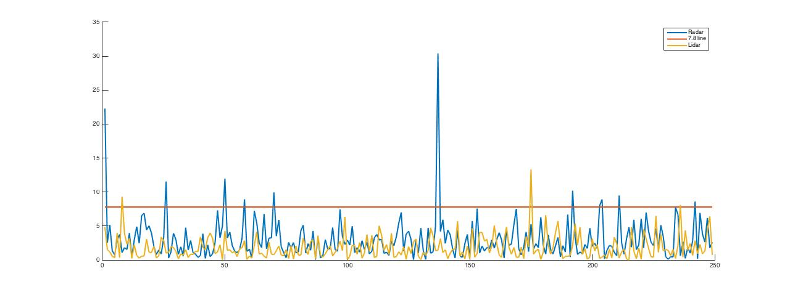

# Unscented Kalman Filter Project

Overview
---

In this project we are going to use Unscented Kalman Filter for tracking objects around self driving car. Laser and Radar data will be used as input to extended Kalman Filter. 

Pipeline
---

*The overall pipeline along with the results will be described here!*

 

I. At first sensor data will be read and Unscented Kalman Filter will be initialized by the first data point. Depending on the sensor type, we use the appropriate update step.

* In order to avoid division by zero, I make sure that the data points are not smaller than a threshold value (0.0001). Also in order to avoid recomputing some of the values, they are precomputed and later on used whenever need be.

II. After initializing kalman filter class, object location(Px, Py) and velocity(Vx, Vy) will be predicted.

III. Once the location is predicted, sensor data will be used to update the location of the object. Based on the sensor type (Laser, Radar), there are two different types of update step. 

* During update step for Radar, we also make sure that the updated φ is in a certain range [-π, π]. 

* After each update step, updated values will be pushed into an estimate array in order to calculate the root mean square error(rmse) between the predicted values and actual ground truth values. As can be seen in the following gif video, the errors for (Px, Py, Vx, Vy) are [0.0768, 0.0800, 0.3202, 0.2674] at the end of the simulation.

IV. Here also I brought the NIS plot for radar and lidar as well as 7.8 line. As it can be seen in the following plot, both of them perform fairly well. But radar is performing better because it's spike are going over the 7.8 line more regularly. There could be some improvements to the lidar parameters.

<!--  -->
<!--  -->

 
  

